# Diário de Laboratório — Dia 4

**Data:** 13/07/2026  
**Etapa:** Etapa 2 — Comunicação UART  
**Prática:** Loopback físico, padrões de bytes e transmissão de mensagem  
**Horário de início:** 15h50  
**Horário de término:** 17h50  
**Tempo total de estudo:** 2 horas  

---

## 1. Objetivos do dia

Os objetivos desta sessão foram:

1. implementar e validar um loopback físico utilizando a UART2 do ESP32;
2. transmitir e receber o byte `0x55`;
3. analisar o quadro UART no formato 8N1;
4. provocar uma falha controlada removendo o jumper entre TX e RX;
5. transmitir diferentes padrões de bytes;
6. comparar as formas de onda de `0x00`, `0xFF`, `0x55`, `0xAA` e `0x41`;
7. transmitir a mensagem `"UART"` em uma única operação;
8. validar a mensagem recebida pelo firmware e pelo analisador lógico.

O GPIO17 foi configurado como TX e o GPIO16 como RX. Os dois pinos foram conectados por um jumper para que o ESP32 recebesse os mesmos dados transmitidos.

O analisador lógico foi conectado ao GPIO17 para observar e decodificar o sinal UART.

---

## 2. Configuração utilizada

| Parâmetro | Configuração |
|---|---|
| Controlador | ESP32 |
| Framework | ESP-IDF |
| UART | UART2 |
| TX | GPIO17 |
| RX | GPIO16 |
| Baud rate | 9600 baud |
| Bits de dados | 8 |
| Paridade | Nenhuma |
| Bits de parada | 1 |
| Formato | 8N1 |
| Controle de fluxo | Desabilitado |
| Buffer RX | 1024 bytes |
| Analisador lógico | Saleae Logic |
| Canal utilizado | CH0 |

---

## 3. Montagem física

A ligação utilizada foi:

```text
GPIO17 — UART2 TX ─────┬──── GPIO16 — UART2 RX
                       │
                       └──── CH0 do analisador lógico

GND do ESP32 ─────────────── GND do analisador lógico
```

O GPIO17 foi configurado como saída UART e o GPIO16 como entrada UART.

A ligação entre TX e RX foi utilizada apenas para o loopback físico.

---

## 4. Primeira implementação — loopback do byte `0x55`

O firmware inicial foi desenvolvido para:

1. instalar o driver da UART2;
2. configurar a comunicação em 9600 baud e formato 8N1;
3. configurar GPIO17 como TX;
4. configurar GPIO16 como RX;
5. transmitir o byte `0x55`;
6. aguardar o término da transmissão;
7. receber um byte pela UART2;
8. comparar o valor transmitido com o recebido;
9. registrar sucesso, falha ou timeout no monitor serial;
10. repetir o teste periodicamente.

O resultado esperado era:

```text
TX=0x55 | RX=0x55 | LOOPBACK OK
```

O resultado foi obtido repetidamente, confirmando o funcionamento da UART2 e da ligação física entre TX e RX.

---

## 5. Análise do byte `0x55`

O byte transmitido foi:

```text
0x55 = 01010101
```

Como a UART transmite primeiro o bit menos significativo, os bits de dados foram enviados na ordem:

```text
D0 D1 D2 D3 D4 D5 D6 D7
 1  0  1  0  1  0  1  0
```

O quadro no formato 8N1 foi composto por:

```text
1 start bit
8 data bits
0 parity bits
1 stop bit
```

Total:

```text
10 bits por quadro
```

O padrão alternado de `0x55` facilitou a visualização da duração de cada bit.

---

## 6. Cálculos teóricos

Para 9600 baud:

```text
Tempo de bit = 1 / 9600
Tempo de bit ≈ 104,17 µs
```

Para um quadro 8N1 completo:

```text
10 × 104,17 µs ≈ 1,042 ms
```

Para a mensagem `"UART"`, composta por quatro bytes:

```text
4 × 1,042 ms ≈ 4,168 ms
```

---

## 7. Resultado no analisador lógico — `0x55`

O analisador Async Serial identificou corretamente o byte:

```text
0x55
```

A duração medida para um bit foi aproximadamente:

```text
104 µs
```

Esse resultado é compatível com a configuração de 9600 baud.

O padrão alternado de níveis altos e baixos também correspondeu ao byte `0x55`.

### Evidência

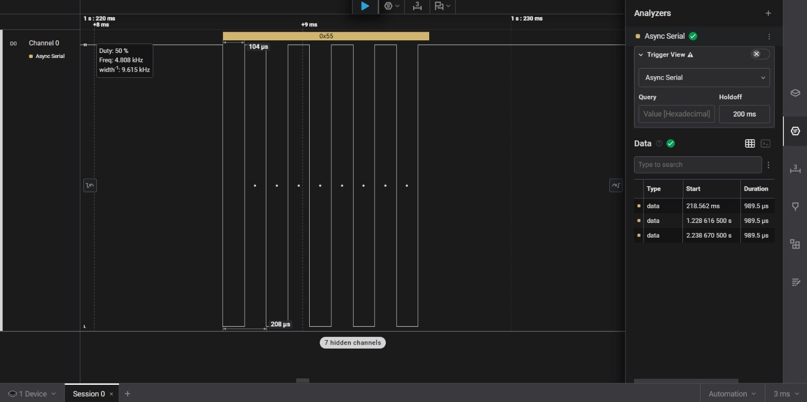

---

## 8. Resultado do loopback

Com o jumper entre GPIO17 e GPIO16 conectado, o firmware apresentou repetidamente:

```text
TX=0x55 | RX=0x55 | LOOPBACK OK
```

Isso confirmou que:

- a UART2 foi inicializada corretamente;
- o GPIO17 transmitiu o byte;
- o GPIO16 recebeu o byte;
- o dado recebido era igual ao transmitido;
- a configuração 9600 baud e 8N1 estava correta.

### Evidência

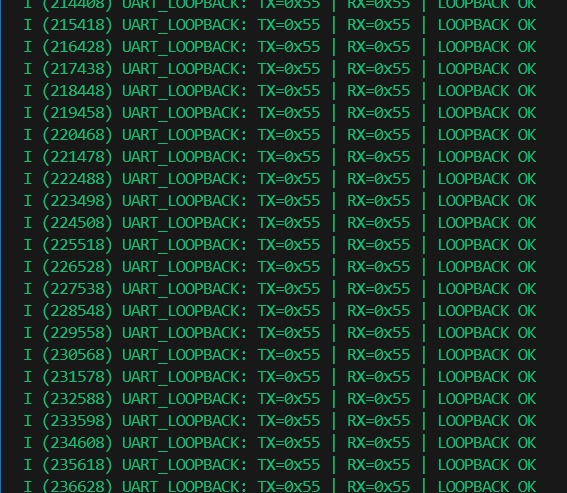

---

## 9. Teste de falha controlada

O jumper entre GPIO17 e GPIO16 foi removido durante a execução.

Inicialmente foi observado um byte incorreto:

```text
TX=0x55 | RX=0x00 | LOOPBACK FALHOU
```

Em seguida, o firmware passou a apresentar timeout:

```text
Nenhum byte recebido: verifique o jumper GPIO17-GPIO16
```

O TX continuou transmitindo normalmente, porém o RX deixou de receber o sinal.

Após reconectar o jumper, o funcionamento foi restaurado e o firmware voltou a apresentar:

```text
LOOPBACK OK
```

Esse teste demonstrou que a existência de um sinal correto no TX não garante que o dado tenha sido recebido pelo RX.

### Evidência

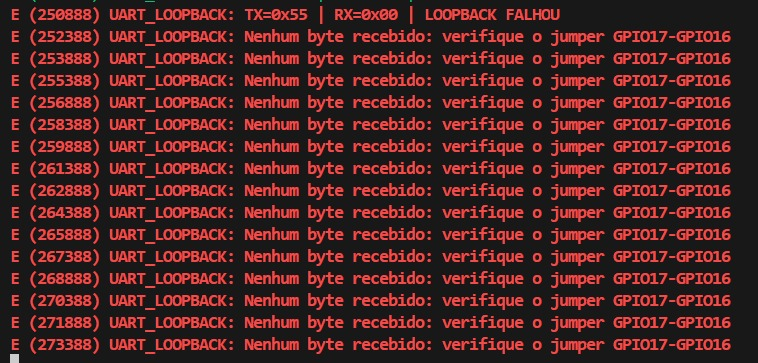

---

## 10. Teste de diferentes padrões de bytes

Depois do loopback básico, o firmware foi alterado para transmitir a sequência:

```text
0x00
0xFF
0x55
0xAA
0x41
```

O intervalo entre os bytes foi reduzido para permitir a captura dos cinco quadros na mesma janela do analisador lógico.

O resultado no firmware foi:

```text
TX=0x00 | RX=0x00 | OK
TX=0xFF | RX=0xFF | OK
TX=0x55 | RX=0x55 | OK
TX=0xAA | RX=0xAA | OK
TX=0x41 | RX=0x41 | OK
```

### 10.1 Byte `0x00`

```text
0x00 = 00000000
```

O start bit e os oito bits de dados permaneceram em nível baixo.

Tempo teórico do trecho baixo:

```text
9 × 104,17 µs ≈ 937,5 µs
```

O comportamento observado no Saleae foi compatível com o valor teórico.

### 10.2 Byte `0xFF`

```text
0xFF = 11111111
```

Apenas o start bit permaneceu em nível baixo. Os oito bits de dados e o stop bit permaneceram em nível alto.

### 10.3 Byte `0x55`

```text
0x55 = 01010101
```

O sinal apresentou alternância frequente entre níveis alto e baixo.

### 10.4 Byte `0xAA`

```text
0xAA = 10101010
```

Como a transmissão ocorre LSB first, o padrão transmitido foi:

```text
0 1 0 1 0 1 0 1
```

O resultado observado foi o padrão inverso de `0x55`.

### 10.5 Byte `0x41`

```text
0x41 = 01000001
```

Esse valor corresponde ao caractere ASCII:

```text
'A'
```

Transmitido LSB first:

```text
D0 D1 D2 D3 D4 D5 D6 D7
 1  0  0  0  0  0  1  0
```

O trecho de cinco zeros consecutivos apresentou duração aproximada de:

```text
521 µs
```

Valor compatível com:

```text
5 × 104,17 µs ≈ 520,8 µs
```

### Evidências

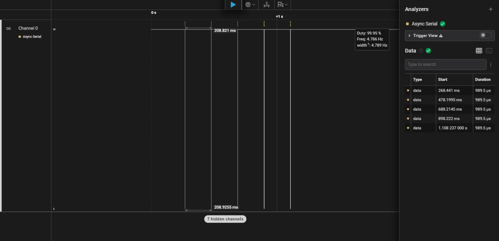

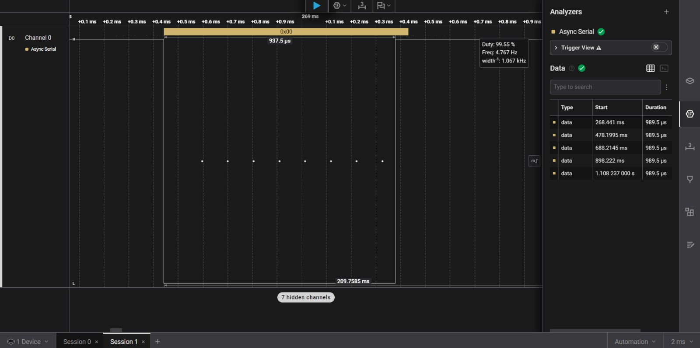

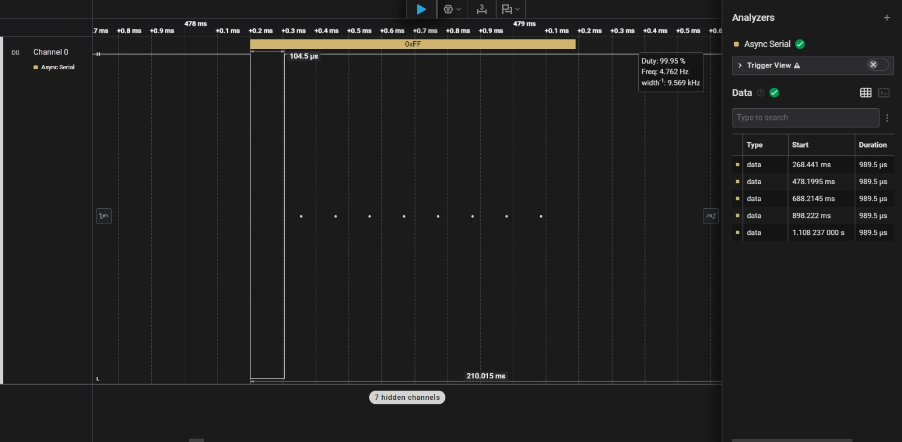

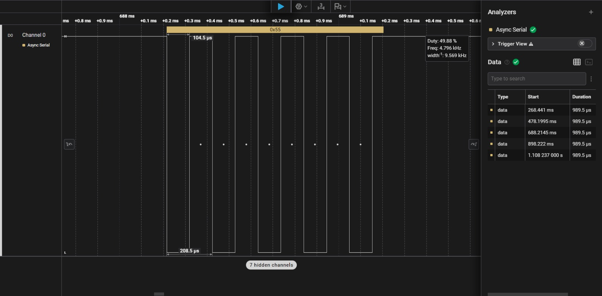

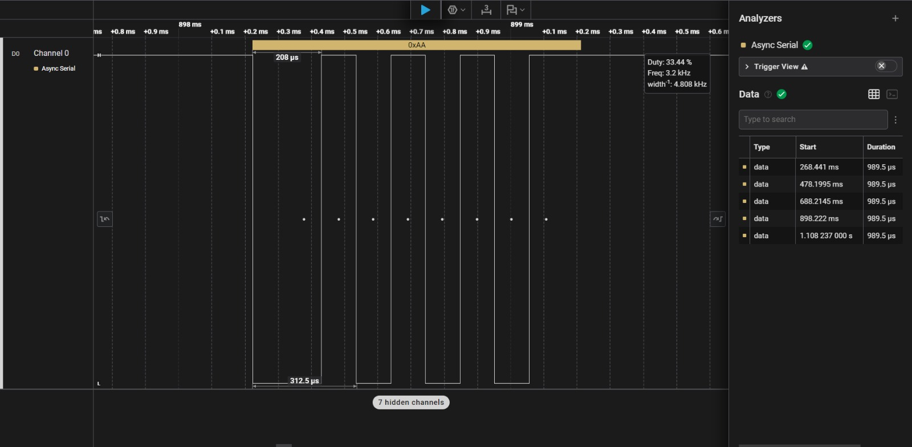

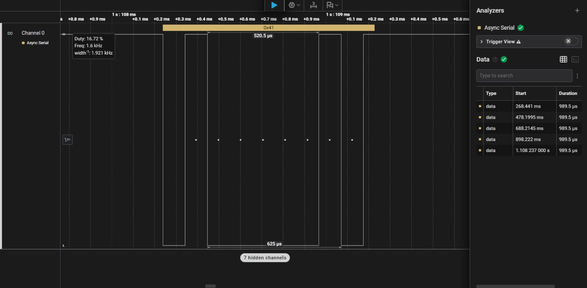

---

## 11. Transmissão da mensagem `"UART"`

O firmware foi modificado para transmitir a string:

```text
UART
```

Representação em hexadecimal:

| Caractere | Hexadecimal |
|---|---:|
| `U` | `0x55` |
| `A` | `0x41` |
| `R` | `0x52` |
| `T` | `0x54` |

A sequência transmitida foi:

```text
55 41 52 54
```

O firmware utilizou uma única chamada de transmissão para enviar os quatro bytes.

A recepção foi armazenada em um buffer e comparada com a mensagem original utilizando `memcmp()`.

O resultado obtido foi:

```text
TX [4 bytes]: UART
RX [4 bytes]: UART
COMPARACAO: LOOPBACK OK
```

---

## 12. Diferença entre `sizeof()` e `strlen()`

A string foi declarada como:

```c
static const char tx_message[] = "UART";
```

Na memória, ela ocupa:

```text
'U' 'A' 'R' 'T' '\0'
```

Portanto:

```text
sizeof(tx_message) = 5
strlen(tx_message) = 4
```

O terminador `\0` existe na memória, mas não foi transmitido nesta prática.

Esse teste permitiu diferenciar:

- tamanho total do array;
- comprimento útil da string;
- quantidade real de bytes transmitidos.

---

## 13. Resultado da mensagem no analisador lógico

O Saleae decodificou corretamente os quatro bytes:

```text
0x55  0x41  0x52  0x54
  U     A     R     T
```

Cada caractere apresentou seu próprio quadro UART:

```text
start bit + 8 bits de dados + stop bit
```

Logo, a palavra `"UART"` foi formada por quatro quadros consecutivos.

A duração de um bit permaneceu próxima de:

```text
104 µs
```

O trecho de cinco bits baixos do caractere `A` apresentou aproximadamente:

```text
521 µs
```

Também foi observada uma região de aproximadamente:

```text
208 µs
```

correspondente a dois tempos consecutivos de bit.

### Evidências

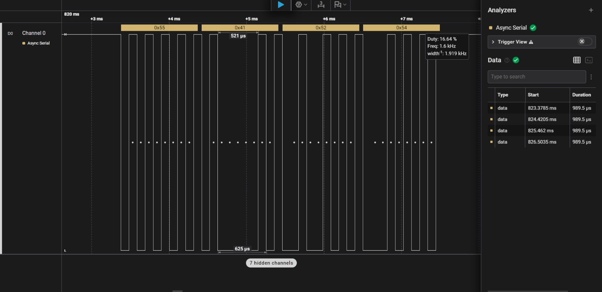

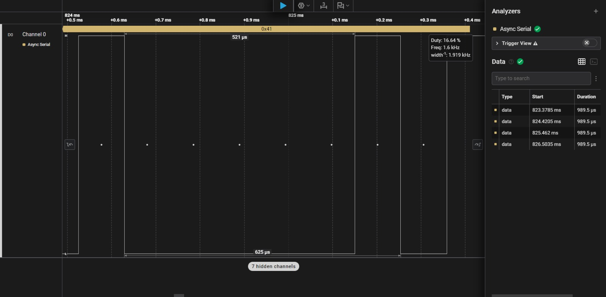

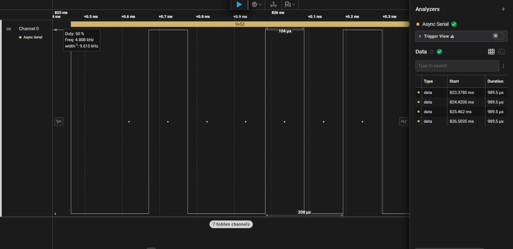

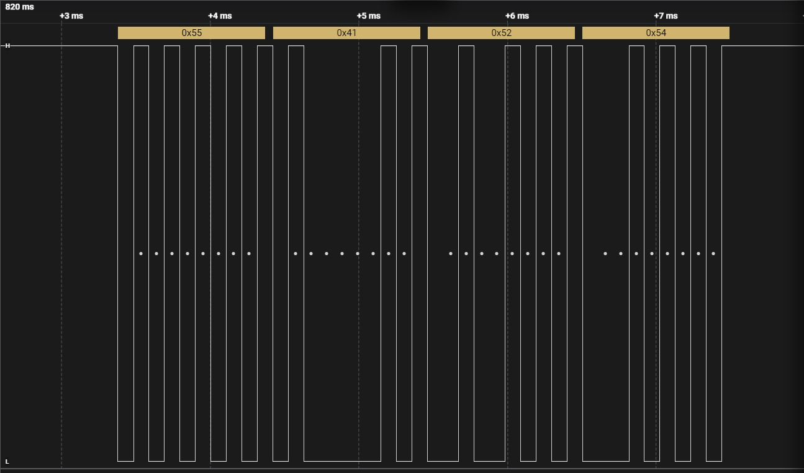

---

## 14. Dificuldades encontradas

### 14.1 ESP32 não detectado pelo Windows

Durante a preparação, o conversor CP210x deixou de aparecer na lista de dispositivos conectados.

A placa voltou a ser reconhecida após:

1. desconectar o ESP32;
2. remover temporariamente os jumpers;
3. reconectar a placa;
4. verificar novamente o dispositivo USB.

Não foi possível afirmar definitivamente que os jumpers foram a causa, mas a placa voltou a enumerar após essa sequência.

### 14.2 Build executado na pasta incorreta

Inicialmente, o comando foi executado dentro de:

```text
firmware/lab_02_uart/main
```

Essa pasta contém apenas o componente principal.

O build correto deve ser executado na raiz do projeto:

```text
firmware/lab_02_uart
```

### 14.3 `GPIO_NUM_16` e `GPIO_NUM_17` não declarados

O compilador apresentou erro porque os identificadores dos GPIOs não estavam declarados.

A correção foi adicionar:

```c
#include "driver/gpio.h"
```

Também foi adicionada a dependência:

```cmake
esp_driver_gpio
```

no arquivo `main/CMakeLists.txt`.

### 14.4 Firmware anterior continuou sendo executado

Após iniciar a prática da string `"UART"`, a saída do monitor continuava mostrando o teste anterior de padrões de bytes.

Foi verificado que o arquivo:

```text
firmware/lab_02_uart/main/main.c
```

ainda continha o código antigo.

O arquivo correto foi atualizado, salvo, recompilado e gravado novamente.

### 14.5 Limitação de visualização por excesso de zoom

Ao ampliar excessivamente a forma de onda no Saleae, parte do contexto do quadro era perdida.

A solução foi utilizar diferentes níveis de zoom:

1. visão geral da mensagem;
2. zoom intermediário em um quadro;
3. zoom local para medir um único bit.

---

## 15. Aprendizados do dia

Durante esta prática, foram estudados e validados:

- diferença entre UART TX e UART RX;
- loopback físico;
- configuração da UART2;
- formato UART 8N1;
- estado ocioso da linha em nível alto;
- start bit em nível baixo;
- transmissão LSB first;
- duração de um bit em 9600 baud;
- estrutura de um quadro com 10 períodos;
- diferença entre sinal transmitido e dado recebido;
- uso de timeout na recepção;
- comparação entre TX e RX;
- comportamento dos bytes `0x00`, `0xFF`, `0x55`, `0xAA` e `0x41`;
- relação entre ASCII e hexadecimal;
- transmissão de múltiplos bytes em uma única chamada;
- uso de buffers de recepção;
- uso de `strlen()`, `sizeof()` e `memcmp()`;
- importância do terminador `\0` em strings C;
- diferença entre byte individual, array e string;
- análise de quadros UART consecutivos;
- importância do diretório correto no ESP-IDF;
- dependências e cabeçalhos de drivers;
- uso conjunto do monitor serial e do analisador lógico;
- recuperação da comunicação após reconectar o jumper;
- organização de evidências técnicas.

---

## 16. Critérios de validação

### Loopback básico

- [x] Projeto compilado
- [x] Firmware gravado no ESP32
- [x] UART2 configurada
- [x] GPIO17 utilizado como TX
- [x] GPIO16 utilizado como RX
- [x] Comunicação configurada em 9600 baud
- [x] Formato 8N1 validado
- [x] Byte `0x55` transmitido
- [x] Byte `0x55` recebido
- [x] Loopback validado pelo firmware
- [x] Byte decodificado pelo analisador lógico
- [x] Tempo de bit medido em aproximadamente 104 µs
- [x] Falha provocada pela remoção do jumper
- [x] Timeout de recepção observado
- [x] Comunicação restaurada após reconexão

### Padrões de bytes

- [x] Byte `0x00` transmitido e recebido
- [x] Byte `0xFF` transmitido e recebido
- [x] Byte `0x55` transmitido e recebido
- [x] Byte `0xAA` transmitido e recebido
- [x] Byte `0x41` transmitido e recebido
- [x] Cinco padrões capturados na mesma sequência
- [x] Diferenças entre as formas de onda analisadas
- [x] Relação entre `0x41` e o caractere ASCII `A` validada

### Mensagem `"UART"`

- [x] `sizeof("UART")` apresentou 5 bytes
- [x] `strlen("UART")` apresentou 4 bytes
- [x] Quatro bytes foram transmitidos
- [x] Quatro bytes foram recebidos
- [x] Mensagem TX exibida como `"UART"`
- [x] Mensagem RX exibida como `"UART"`
- [x] Comparação com `memcmp()` validada
- [x] Saleae decodificou `55 41 52 54`
- [x] Quatro quadros consecutivos foram observados
- [x] Tempo de bit permaneceu próximo de 104 µs
- [x] Evidências foram organizadas e salvas

---

## 17. Autoavaliação

| Área | Avaliação de 0 a 5 |
|---|---:|
| Compreensão do quadro UART | 4 |
| Configuração da UART no ESP-IDF | 4 |
| Análise da forma de onda | 4 |
| Diagnóstico de erros | 4 |
| Organização e documentação | 4 |

### Pontos que consigo explicar sem consultar

- função do TX e do RX em uma comunicação UART;
- estrutura de um quadro UART 8N1;
- motivo do estado ocioso da linha permanecer em nível alto;
- função do start bit e do stop bit;
- transmissão dos bits em ordem LSB first;
- cálculo do tempo de bit a partir do baud rate;
- diferença entre `0x55`, `0xAA`, `0x00` e `0xFF`;
- relação entre valores ASCII e hexadecimal;
- diferença entre `sizeof()` e `strlen()`;
- funcionamento básico de um loopback físico.

### Pontos que ainda preciso revisar

- comportamento de recepção parcial;
- uso de fila de eventos do driver UART;
- tratamento de overflow de buffer;
- erros de paridade e enquadramento;
- organização da recepção em tasks separadas;
- definição de protocolo e delimitadores para mensagens maiores.

---

## 18. Conclusão do dia

A prática do Dia 4 foi concluída com sucesso.

O loopback físico da UART2 foi validado utilizando GPIO17 como TX e GPIO16 como RX. O byte `0x55` foi transmitido e recebido corretamente, e o analisador lógico confirmou o tempo de bit próximo de `104 µs`.

Também foram analisados diferentes padrões de bytes, permitindo observar como o valor transmitido altera a forma de onda sem modificar o baud rate.

Por fim, a mensagem `"UART"` foi transmitida como quatro bytes consecutivos, recebida em um buffer e comparada com a mensagem original. O monitor serial e o Saleae confirmaram a sequência:

```text
55 41 52 54
```

A sessão encerrou com a UART2 funcionando de forma estável em 9600 baud, formato 8N1, com validação por firmware e instrumentação externa.

---

## 19. Próximo passo

O próximo experimento da Etapa 2 será estudar recepção parcial.

A mensagem `"UART"` será transmitida normalmente, mas o firmware realizará leituras menores, por exemplo:

```text
Leitura 1: UA
Leitura 2: RT
```

O objetivo será compreender:

- por que uma chamada de leitura pode não retornar toda a mensagem;
- como acumular dados em um buffer;
- como controlar o índice de escrita;
- como detectar quando uma mensagem está completa;
- como evitar assumir que um pacote inteiro chega em uma única operação.